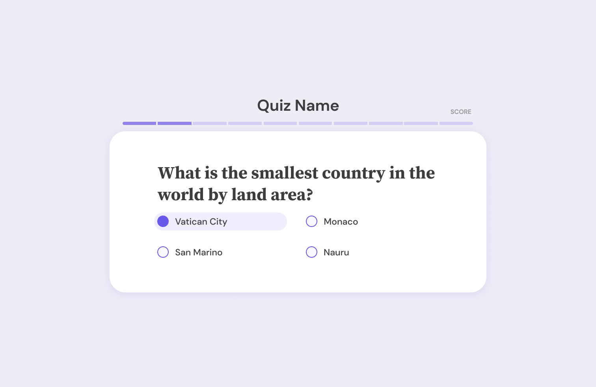
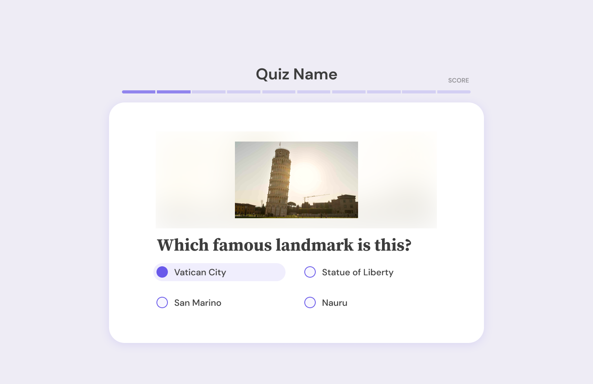

# Svelte Survey 
Svelte Survey is a component library that allows you to easily create quizzes using Svelte. It includes two quiz options: Text Quizzes and Image Quizzes. All the components and logic are built, so all you need to do is provide the data for the questions.

# Installation
To install the library, run the following command:

`npm i svelte-survey-test`

# Usage

## Text Quiz Component

To use the Text Quiz component, import it and provide the data for the questions. The data should be formatted as an object with a "data" property that contains an array of question objects. Each question object should have an "answer" property and a "question" property.

Here's an example:

```
<script>
  import { TextQuiz } from "svelte-survey-test";

const textData: { data: string } = {"data": '[{"question":"What is the point of anything?","answer":"idfk","wrongOp1":"poodle","wrongOp2":"fsdf sdf s","wrongOp3":"fsdfsd fsd"},{"question":"https://images.dog.ceo/breeds/chihuahua/n02085620_2650.jpg","answer":"chihuahua","wrongOp1":"fsdfsdfs","wrongOp2":"poodle","wrongOp3":"fsdfsdfsd"},{"question":"https://images.dog.ceo/breeds/hound-walker/n02089867_3177.jpg","answer":"hound-walker","wrongOp1":"fsdfsdfsdf","wrongOp2":"poodle","wrongOp3":"fsdfsdfsdfs"},{"question":"https://images.dog.ceo/breeds/spaniel-welsh/n02102177_707.jpg","answer":"spaniel-welsh","wrongOp1":"poofsdfsdfdle","wrongOp2":"fsdfsdfs fsd fsd ","wrongOp3":"fsdfsd fsd f "}]'};

</script>

<TextQuiz data={textData} />
```

## Image Quiz Component

To use the Image Quiz component, import it and provide the data for the questions. The data should be formatted as an object with a "data" property that contains an array of question objects. Each question object should have an "imageUrl" property, a "answer" property, and an "answer" property.

Here's an example:

```
<script>
  import { ImageQuiz } from "svelte-survey-test";

  const imageData: { data: string } = {"data": '[{"image": "https://images.dog.ceo/breeds/poodle-miniature/n02113712_3203.jpg", "answer": "poodle" },{"image": "https://images.dog.ceo/breeds/chihuahua/n02085620_2650.jpg", "answer": "chihuahua"},{"image": "https://images.dog.ceo/breeds/hound-walker/n02089867_3177.jpg", "answer": "hound-walker"},{"image": "https://images.dog.ceo/breeds/spaniel-welsh/n02102177_707.jpg", "answer": "spaniel-welsh"}]'};
</script>

<ImageQuiz data={imageData} />
```

# Contributing
Contributions are welcome! If you find a bug or have a feature request, please open an issue or submit a pull request.

# License
Svelte Survey is MIT licensed.